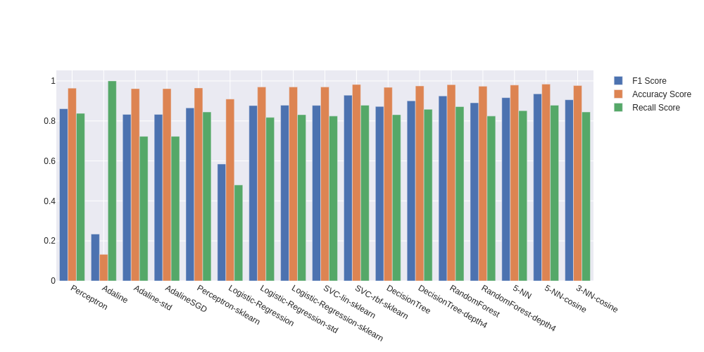

# Machine Learning with Python 

Python implementation of ML classifiers for ham/spam text classification.

## Motivation

This repository was created to gain a better understanding of the existing Machine Learning algorithms and all of the concepts behind those. This project implements machine learning algorithms presented in the [Machine Learning with PyTorch and Scikit-Learn Book](https://sebastianraschka.com/blog/2022/ml-pytorch-book.html) on a ham/spam classification problem.

The project use a Spam/Ham dataset found on [Kaggle](https://www.kaggle.com/datasets/bagavathypriya/spam-ham-dataset), manually selected features were extracted from messages using [spacy](https://spacy.io/).


## Running model trainings

A [shell.nix](shell.nix) file is provided with all required packages. To run trainings, enter the provided nix-shell environement and execute the [train.py](train.py) script:

```bash 
# cd ml-with-python-ham-spam
nix-shell 
python3 train.py
```

## Model performances on dataset
Since we are training multiple models (with arbitrary hyperparameter values), here is a comparison of classification performance metrics:



